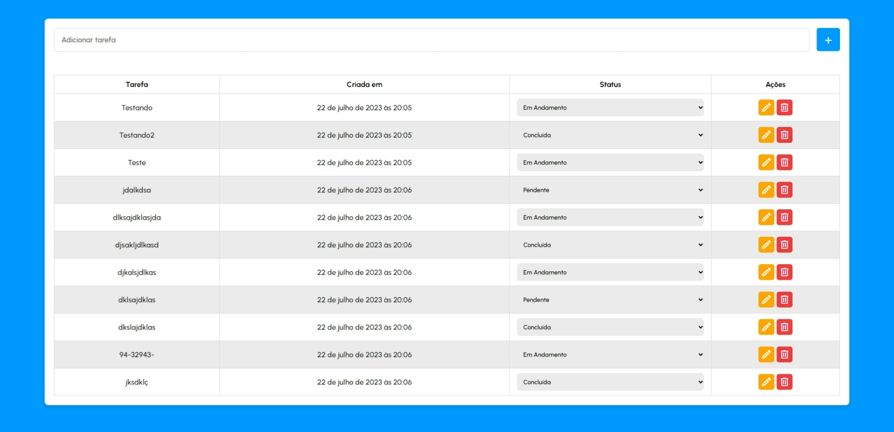

<h1 align="center" style="font-weight: bold;">Lista de Tarefas</h1>

<p align="center">
  <a href="#tech">Tecnologias</a> • 
  <a href="#about">Sobre</a> •
  <a href="#started">Começando</a> • 
  <a href="#colab">Colaboradores</a> •
  <a href="#contribute">Contribuir</a>
</p>

<p align="center">
    <b>O projeto consiste em uma aplicação Full Stack com o objetivo de auxiliar no gerenciamento de atividades e tarefas.</b>
</p>

<h2 id="layout">🎨 Layout</h2>

<p align="center"></p>

<h2 id="tech">💻 Tecnologias</h2>

- [HTML](https://devdocs.io/html) - Linguagem de marcação para estruturar a interface da aplicação.
- [CSS](https://devdocs.io/css) - Utilizado para estilizar a página, tornando-a atraente e responsiva.
- [JavaScript](https://devdocs.io/javascript) - Responsável pela lógica de interação e funcionalidades da aplicação.
- [Docker](https://devdocs.io/docker) - Utilizado para facilitar a criação e o gerenciamento de contêiners da aplicação.
- [MySQL](https://dev.mysql.com/doc/) - Banco de dados para armazenar as informações das tarefas.
- [Nodemon](https://nodemon.io/) - Ferramenta que auxilia no desenvolvimento, monitorando alterações no código e reiniciando automaticamente o servidor.
- [MySQL2](https://www.npmjs.com/package/mysql2) - Pacote que fornece uma interface para interagir com o banco de dados MySQL no NodeJS.
- [Cors](https://www.npmjs.com/package/cors) - Pacote que habilita o acesso de recursos de outros domínios, garantindo a segurança da aplicação.
- [Express](https://devdocs.io/express/) - Framework para NodeJS que simplifica o desenvolvimento da API da aplicaçaõ.
- [DotEnv](https://www.npmjs.com/package/dotenv) - Módulo que carrega variáveis de ambiente a partir de um arquivo, facilitando a configuração.
- [ESLint](https://eslint.org/docs/latest/) - Ferramenta para identificar e corrigir problemas no código, garantindo um código limpo e padronizado.

<h2 id="about">Sobre</h2>

<p>A Lista de Tarefas é um projeto que permite ao usuário gerenciar suas tarefas de forma eficiente. Com esta aplicação, é possível adicionar, editar e excluir tarefas de maneira simples e organizada.</p>

<h3>Funcionalidades</h3>

<b>Adicionar tarefas</b> - Os usuários podem criar novas tarefas, atribuindo um título e status para cada uma delas.

<b>Editar tarefas</b> - É possível fazer alterações nas tarefas existentes, permitindo alterar o título e o status conforme necessário.

<b>Excluir tarefas</b> - Os usuários podem remover tarefas que já foram concluídas ou não são mais relevantes.

<b>Gerenciamento de tarefas</b> - A interface intuitiva e amigável facilita a visualização e organização das tarefas.

<h2 id="started">🚀 Começando</h2>

<h3>Clonando</h3>

Como clonar o projeto:
```bash
git clone https://github.com/vdonoladev/todoList-fullStack.git
```

Depois de clonar o repositório, é necessário criar o <b>Banco de Dados</b> junto com as colunas necessárias.

```bash
CREATE DATABASE database_name
```

A seguir, é necessário criar a tabela <b>tasks</b> que será utilizada pela aplicação.

```bash
CREATE TABLE tasks (
  id INT PRIMARY KEY AUTO_INCREMENT,
  title VARCHAR(45) NOT NULL,
  status VARCHAR(45) NOT NULL,
  created_at VARCHAR(45) NOT NULL
)
```

Na <b>raiz</b> do projeto, haverá um arquivo com o nome <b>.env.example</b>. Este arquivo contém cinco campos que deverão ser preenchidos em um arquivo com o nome <b>.env</b>. Basta criá-lo. 
<p>Depois, basta preencher os campos com os dados referentes ao seu banco de dados.</p>

```bash
PORT=[Porta na qual o servidor será executado]
MYSQL_HOST=[O host da sua máquina, por padrão é "localhost"]
MYSQL_USER=[Seu nome de usuário, por padrão, o MySQL usa o usuário "root"]
MYSQL_PASSWORD=[A senha que você escolheu ao instalar o MySQL]
MYSQL_DB=[O nome do banco de dados criado anteriormente]
```

<h3>Iniciando</h3>

Antes de iniciar a aplicação, é preciso instalar os <b>node_modules</b> e, para isso, basta seguir o tutorial abaixo.

<h4>Como iniciar o projeto:</h4>
Entre na <b>pasta raiz</b> do projeto:

```bash
cd todoList-fullStack
```

Entre na pasta <b>backend</b>:
```bash
cd backend
```

Para instalar as <b>dependências necessárias</b>:
```bash
npm install
```

Para rodar o <b>backend</b> da aplicação:
```bash
npm start
```
- O <b>servidor</b> estará rodando no ```http://localhost:3333```

<br>

Para rodar o <b>frontend</b> da aplicação:
- Abra o arquivo <b>index.html</b> com a extensão <b>Live Server</b>.
- Agora você pode abrir o <b>navegador</b> e digitar: ```http:localhost:5500```

<br>

- Para rodar o <b>frontend</b> da aplicação, recomendo utilizar a extensão [Live Server](https://marketplace.visualstudio.com/items?itemName=ritwickdey.LiveServer) no VSCode.
- Recomendo terem instalado no VSCode as extensões [Docker](https://marketplace.visualstudio.com/items?itemName=ms-azuretools.vscode-docker) e [Database Client](https://marketplace.visualstudio.com/items?itemName=cweijan.vscode-database-client2).
  - Não vou falar sobre como instalar e usar cada uma delas. 
  - Presumo que já saiba usar o Docker.
- Instale a imagem do MySQL no Docker.
  - Lembrando que você tem que instalar o Docker em sua máquina.

<br>


<h2 id="colab">🤝 Colaboradores</h2>

Agradecimento especial a todas as pessoas que contribuíram para este projeto.

<table>
  <tr>
    <td align="center">
      <a href="#">
        <br>
        <sub>
          <b>Víctor Donola Ferreira</b>
        </sub>
      </a>
    </td>
  </tr>
</table>

<h2 id="contribute">📫 Contribuir</h2>

1. `git clone https://github.com/vdonoladev/todoList-fullStack.git`
2. `git checkout -b feature/NAME-OF-FEATURE`
3. Siga os **Commit Patterns**
4. Abra um **Pull Request** explicando o problema resolvido ou o recurso feito, se houver, anexe a captura de tela das modificações visuais e aguarde a revisão!

<h3>Documentações que podem ajudar</h3>

- [📝 How to create a Pull Request](https://www.atlassian.com/br/git/tutorials/making-a-pull-request)

- [💾 Commit pattern](https://gist.github.com/joshbuchea/6f47e86d2510bce28f8e7f42ae84c716)

<h4>Créditos</h4>

A <b>aplicação</b> foi desenvolvida seguindo a série de vídeos do <b>Manual do Dev</b>.

- [GitHub](https://github.com/manualdodev)
- [YouTube](https://www.youtube.com/@ManualdoDev)
- [Playlist](https://youtube.com/playlist?list=PLdtmpu_1ITQJ1Y2-ZBbE7ROP6u1kU0J5l)
